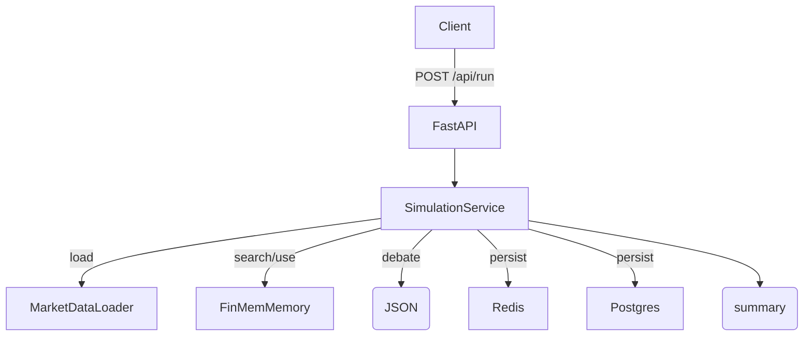

# LLM 멀티에이전트 토론 & 메모리 실험 발표자료

## 1. 시스템/스택 한눈에 보기
- API: FastAPI (`routers/simulation.py`) + Pydantic 요청/응답 스키마
- LLM: Ollama JSON 모드 (`services/llm.py`)로 구조화 출력, 시드/재시도 지원
- 임베딩: `nomic-embed-text` → Redis VectorStore (`memory/redis_store.py`)
- 오케스트레이션: 수기 async 순서 (`services/simulation.py::_run_manual_rounds`) + 참고용 LangGraph(`agents/graph.py`)
- 데이터: MarketDataLoader 스냅샷, 결과/로그는 Postgres (`db.models`)
- 관측/피드백: `services/metrics.py` 기록, `FeedbackService` 비동기 피드백 훅

## 2. 아키텍처 & 호출 흐름

- 입력: `ticker`, `window`, `news`, `mode`, `interval`, `bb_rounds`, `seed`, `use_memory` 등
- 출력: `SimulationSummary` JSON (decision/report/bull/bear/reflection/snapshot/meta) + `simulation_id`

## 3. API 계약 (FastAPI 레이어)
- `routers/simulation.py`의 `SimulationRequest/Response`로 타입 검증
- 엔드포인트:
```python
@router.post("/run", response_model=SimulationResponse)
async def run_simulation(payload: SimulationRequest, service: SimulationService = Depends(get_service)):
    result = await service.run(...)
    return SimulationResponse(simulation_id=result.simulation_id, status="completed", summary=result.summary)
```
- 응답은 항상 구조화 JSON을 보장 (LLM 오류 시 fallback 포함)

## 4. 토론 모듈 알고리즘 (핵심 코드)
### 4.1 실행 진입점
- `services/simulation.py::run` → 스냅샷 로드 → `run_on_snapshot`
- LTM 검색: `FinMemMemory.search` (역할/Recency/Salience 가중)
- 초기 상태: `TradeState(snapshot, memories, working_mem=[])`

### 4.2 토론 시퀀스
```python
async def _run_manual_rounds(state, bb_rounds, memory_store_manager_only, seed):
    for _ in range(bb_rounds):
        state = await self._bull(...)
    state = await self._bear(...)
    state = await self._trader(...)
    state = await self._manager(...)
    state = await self._reflection(...)
    return state
```
- Bull/Bear 교대 → Trader 결정 → Manager 종합 → Reflection 회고
- `working_mem` 롤링 창(`working_mem_max`)으로 프롬프트 컨텍스트 유지

### 4.3 LLM 호출 안전장치 (보고서 왜곡/할루시네이션 완화)
```python
async def _generate_with_retry(prompt, seed, fallback):
    for attempt in range(llm_max_retries+1):
        resp = await llm.generate(prompt, seed=current_seed)  # JSON 모드
        obj = json.loads(resp)
        return json.dumps(obj, ensure_ascii=False)
    return json.dumps(fallback, ensure_ascii=False)
```
- JSON 모드 + 파싱 실패 시 재시도(시드 해제) → 끝까지 실패하면 스키마와 맞는 안전 fallback 반환
- 모든 role 출력은 `_safe_json`으로 필수 키를 채워 API 계약 유지

### 4.4 프롬프트 스키마 (비유적 표현 억제)
- `agents/prompts.py`: “반드시 유효한 JSON만 출력”, “요약은 핵심/간결하게”로 제약 → 장황/비유적 서술 축소
- 역할별 JSON 필드 강제: Bull/Bear `summary/risks[]`, Trader `action/rationale/confidence`, Manager `risks/strategy/next_steps`, Reflection `reflection/actions`

### 4.5 메모리 계층 (왜곡 방지 + 지속성)
- `FinMemMemory.search` 점수: `sim * role_weight - recency_lambda*age_days + salience_weight*sal`
- 중복/짧은 문장 필터: `add_memory`에서 길이·중복 검사 → 무의미/반복 로그 저장 방지
- 롤업: Manager 리포트가 `rollup_count` 배수일 때 LLM 요약 후 재저장 → LTM 품질 유지
- Redis VectorStore 초기화/검증: `memory/redis_store.py`

## 5. 역할/모듈 별 구현 (무엇을 어떻게 만들었나)
- **_bull(state, memory_store_manager_only, seed)**: 스냅샷/메모리를 Bull 프롬프트에 주입해 `{"summary","risks":[]}` JSON을 생성하고 working_mem/LTM에 기록(매수 논거 수집 담당).
- **_bear(state, memory_store_manager_only, seed)**: Bear 관점 JSON(`summary/risks`) 생성 및 working_mem/LTM 기록(매도 논거 수집 담당).
- **_trader(state, memory_store_manager_only, seed)**: Bull/Bear 출력과 포트폴리오를 받아 `{"action","rationale","confidence"}` JSON으로 매매 결정을 내리고 선택적으로 LTM 저장.
- **_manager(state, seed)**: Bull/Bear/Trader 결과를 통합해 `{"risks","strategy","next_steps"}`를 작성, 항상 LTM에 저장하는 중개·조정자 역할(핵심 신뢰 소스).
- **_reflection(state, seed)**: 의사결정 후 교훈/액션을 `{"reflection","actions":[]}`로 남기고 높은 salience로 저장해 이후 검색 우선순위 상승.
- **_add_working(state, content, role)**: 최근 발화를 working_mem 롤링 버퍼에 넣어 이후 프롬프트 컨텍스트에 재사용.
- **_generate_with_retry(prompt, seed, fallback)**: Ollama JSON 모드 호출→파싱 실패 시 시드 해제 후 재시도→끝까지 실패 시 스키마 호환 fallback 반환(보고서 왜곡/형식 파손 방지).
- **_safe_json(text, fallback)**: LLM 응답을 파싱해 필수 키를 fallback으로 채워 API 계약 유지.
- **FinMemMemory.search(query, k, ticker, roles)**: Redis 벡터스토어에서 유사도·역할가중치·최근성·salience를 반영해 상위 k개 메모리 반환.
- **FinMemMemory.add_memory(content, metadata)**: 길이/중복/TTL 필터를 거쳐 메모리를 저장, manager 리포트는 rollup_count마다 요약 후 재저장.
- **LangGraph 빌더 (`agents/graph.py::build_graph`)**: 동일 역할 순서를 그래프로 표현해 Bull↔Bear 루프, Trader, Manager 경로를 시각화한 참고 구현.

### 핵심 코드 스니펫
```python
# services/simulation.py (발췌)
async def _bull(self, state, memory_store_manager_only, seed):
    prompt = prompts.BULL_TEMPLATE.format(
        snapshot=self._fmt_snapshot(state.snapshot),
        memories=self._fmt_memories(state.working_mem, state.memories),
    )
    state.bull_view = await self._generate_with_retry(
        prompt, seed=seed, fallback={"summary": "stub bull view", "risks": []}
    )
    self._add_working(state, state.bull_view, "bull")
    if not memory_store_manager_only:
        await self.memory.add_memory(
            content=state.bull_view,
            metadata={"role": "bull", "ticker": state.snapshot.get("ticker", ""), "created_at": time.time()},
        )
    return state

# agents/prompts.py (Bull/Bear 템플릿 발췌)
BULL_TEMPLATE = """
당신은 Bull Analyst입니다. 시장 상승 요인을 분석하세요.
반드시 유효한 JSON만 출력하세요. summary는 핵심/간결하게 작성하세요.

입력 스냅샷: {snapshot}
기억: {memories}

출력 형식:
{
  "summary": "상승 요인 분석 (핵심/간결하게)",
  "risks": ["리스크", "리스크"]
}
"""

BEAR_TEMPLATE = """
당신은 Bear Analyst입니다. 시장 하락 요인을 분석하세요.
반드시 유효한 JSON만 출력하세요. summary는 핵심/간결하게 작성하세요.

입력 스냅샷: {snapshot}
기억: {memories}

출력 형식:
{
  "summary": "하락 요인 분석 (핵심/간결하게)",
  "risks": ["리스크", "리스크"]
}
"""

async def _bear(self, state, memory_store_manager_only, seed):
    prompt = prompts.BEAR_TEMPLATE.format(
        snapshot=self._fmt_snapshot(state.snapshot),
        memories=self._fmt_memories(state.working_mem, state.memories),
    )
    state.bear_view = await self._generate_with_retry(
        prompt, seed=seed, fallback={"summary": "stub bear view", "risks": []}
    )
    self._add_working(state, state.bear_view, "bear")
    if not memory_store_manager_only:
        await self.memory.add_memory(
            content=state.bear_view,
            metadata={"role": "bear", "ticker": state.snapshot.get("ticker", ""), "created_at": time.time()},
        )
    return state

async def _trader(self, state, memory_store_manager_only, seed):
    portfolio = state.snapshot.get("portfolio", {})
    prompt = prompts.TRADER_TEMPLATE.format(
        bull=state.bull_view,
        bear=state.bear_view,
        portfolio=json.dumps(portfolio, ensure_ascii=False),
        memories=self._fmt_memories(state.working_mem, state.memories),
    )
    state.decision = await self._generate_with_retry(
        prompt,
        seed=seed,
        fallback={"action": "HOLD", "rationale": "stub trader decision", "confidence": "low"},
    )
    self._add_working(state, state.decision, "trader")
    if not memory_store_manager_only:
        await self.memory.add_memory(
            content=state.decision,
            metadata={"role": "trader", "ticker": state.snapshot.get("ticker", ""), "created_at": time.time()},
        )
    return state

async def _manager(self, state, seed):
    prompt = prompts.MANAGER_TEMPLATE.format(
        bull=state.bull_view,
        bear=state.bear_view,
        trader=state.decision,
        memories=self._fmt_memories(state.working_mem, state.memories),
    )
    state.report = await self._generate_with_retry(
        prompt,
        seed=seed,
        fallback={"risks": [], "strategy": "stub manager summary", "next_steps": []},
    )
    self._add_working(state, state.report, "manager")
    await self.memory.add_memory(
        content=state.report,
        metadata={"role": "manager", "ticker": state.snapshot.get("ticker", ""), "created_at": time.time()},
    )
    return state

async def _reflection(self, state, seed):
    prompt = prompts.REFLECTION_TEMPLATE.format(
        bull=state.bull_view,
        bear=state.bear_view,
        trader=state.decision,
        manager=state.report,
        memories=self._fmt_memories(state.working_mem, state.memories),
    )
    state.reflection = await self._generate_with_retry(
        prompt,
        seed=seed,
        fallback={"reflection": "stub reflection", "actions": []},
    )
    self._add_working(state, state.reflection, "reflection")
    await self.memory.add_memory(
        content=state.reflection,
        metadata={
            "role": "reflection",
            "ticker": state.snapshot.get("ticker", ""),
            "created_at": time.time(),
            "salience": self.settings.memory_reflection_role_weight,
        },
    )
    return state

def _add_working(self, state, content, role):
    if not content:
        return
    entry = {"content": content, "metadata": {"role": role, "ticker": state.snapshot.get("ticker", ""), "created_at": time.time()}}
    state.working_mem.append(entry)
    if len(state.working_mem) > self.settings.working_mem_max:
        state.working_mem = state.working_mem[-self.settings.working_mem_max :]

async def _generate_with_retry(self, prompt, *, seed, fallback):
    current_seed = seed
    for attempt in range(self.settings.llm_max_retries + 1):
        try:
            resp = await self.llm.generate(prompt, seed=current_seed)  # Ollama JSON
            obj = json.loads(resp)
            return json.dumps(obj, ensure_ascii=False)
        except Exception:
            current_seed = None  # 시드 해제 후 재시도
            continue
    return json.dumps(fallback, ensure_ascii=False)

@staticmethod
def _safe_json(text, fallback):
    if not text:
        return dict(fallback)
    try:
        obj = json.loads(text)
        if isinstance(obj, dict):
            merged = dict(fallback)
            merged.update(obj)
            return merged
        return dict(fallback)
    except Exception:
        return dict(fallback)
```

```python
# memory/finmem_memory.py (발췌)
async def search(self, query: str, k: int = 5, *, ticker=None, roles=None):
    docs_scores = self.store.similarity_search_with_score(query, k=k * 3)
    results = []
    now = time.time()
    for doc, sim in docs_scores:
        md = doc.metadata or {}
        if ticker and md.get("ticker") != ticker:
            continue
        if roles and md.get("role") not in roles:
            continue
        age_days = self._age_days(md, now)
        if self.ttl_days and age_days > self.ttl_days:
            continue
        role_weight = self.role_weights.get(md.get("role", "mem"), 1.0)
        sal = md.get("salience", md.get("pnl", 0.0))
        score = sim * role_weight - self.recency_lambda * age_days + self.salience_weight * float(sal)
        if score < self.score_cutoff:
            continue
        results.append(({"content": doc.page_content, "metadata": md}, score))
    results.sort(key=lambda x: x[1], reverse=True)
    return [r[0] for r in results[:k]]

async def add_memory(self, content: str, metadata: Dict[str, Any]) -> str:
    if self.skip_stub and self.is_stub_embedding:
        return "skipped_stub"
    if len(content or "") < self.min_length:
        return "skipped_short"
    metadata = dict(metadata)
    metadata.setdefault("created_at", time.time())
    if await self._is_duplicate(content, metadata):
        return "deduped"
    memory_id = str(uuid4())
    self.store.add_texts([content], metadatas=[metadata], ids=[memory_id])
    if metadata.get("role") == "manager" and self.llm:
        try:
            count = self.store.client.zcard(self.store.index_name)
        except Exception:
            count = 0
        if count and count % self.rollup_count == 0:
            await self._rollup_manager(metadata.get("ticker"))
    return memory_id
```

```python
# agents/graph.py (발췌: 그래프형 참고 구현)
graph = StateGraph(TradeState)
graph.add_node("bull", bull_node)
graph.add_node("bear", bear_node)
graph.add_node("trader", trader_node)
graph.add_node("manager", manager_node)
graph.set_entry_point("bull")
for _ in range(max_bb_rounds - 1):
    graph.add_edge("bull", "bear")
    graph.add_edge("bear", "bull")
graph.add_edge("bear", "trader")
graph.add_edge("trader", "manager")
graph.add_edge("manager", END)
compiled = graph.compile()
```

## 6. 보고서 왜곡 문제 해결 전략 정리
- **구조화 강제**: Ollama JSON 모드 + `_generate_with_retry` + `_safe_json` → 비정형/비유적 출력 차단
- **컨텍스트 일관성**: `working_mem`에 모든 발화 저장 후 프롬프트 삽입 → 자기모순/망각 감소
- **사실 기반 증거 주입**: `FinMemMemory.search`로 과거 기록/리스크를 재주입 → 임의 환각 감소
- **중복/저품질 차단**: `add_memory`에서 길이, 중복, TTL 필터 → 잡음 축적 방지
- **롤업/가중치**: Manager/Reflection를 더 높은 salience/role weight로 저장 → 핵심 판단이 우선 검색

## 7. API/스키마 요약 (고객 계약)
- 요청: `ticker`(필수), `window=200`, `news=true`, `mode=intraday|daily`, `interval=1h`, `bb_rounds`, `memory_store_manager_only`, `seed`, `use_memory=true`
- 응답: `simulation_id`, `status`, `summary`(SimulationSummary: decision/report/bull/bear/reflection/snapshot/meta/memories)
- 메타 필드에 사용 모델/seed/rounds/메모리 카운트 기록 → 재현성 확보

## 8. 실험 결과 하이라이트 (Exp1, AAPL, seed=42)
- 조건: 기간 2025-09-01~11-20, interval=1h, 초기자본 $10k, 뉴스 포함
- **메모리 OFF vs ON**:
  - Total Return: 6.17% → 10.69% (**+73.3%**)
  - CAGR: 35.48% → 67.35% (**+89.8%**)
  - Turnover(shares): 2146.8 → 208.2 (**-90.3%**, 거래 효율)
  - 리스크 Trade-off: Sharpe 1.264 → 1.103(↓), MaxDD -2.23% → -5.12%(↑)
- 해석: 메모리 사용이 고수익/공격적 전략을 학습, 거래 빈도 축소·포지션 집중 → 수익↑, 변동/낙폭↑

## 9. 재현/운영 가이드
1) Redis/PG/Ollama 기동 후:
```bash
python -m uvicorn main:app --reload
```
2) 시뮬레이션 호출 예시:
```bash
curl -X POST http://localhost:8000/api/run \
  -H "Content-Type: application/json" \
  -d '{"ticker":"AAPL","window":120,"news":true,"bb_rounds":2,"use_memory":true}'
```
3) 백테스트 스크립트(Exp1 동일 설정): `scripts/run_backtest.py --ticker AAPL --start-date 2025-09-01 --end-date 2025-11-20 --seed 42 --use-memory`

## 10. 요약 메시지
- 메모리-강화 멀티에이전트 토론으로 **구조화된 결정**과 **경험 재활용**을 구현
- JSON 모드+재시도+프롬프트 제약으로 **보고서 왜곡/비유적 표현 최소화**
- Manager/Reflection/Feedback 루프로 **중개·검수·학습 사이클** 구축
- 실험에서 **수익은 ↑, 리스크는 함께 ↑** → 리스크 선호에 맞춰 `bb_rounds`, `role_weights`, `llm_temperature` 튜닝 권장
